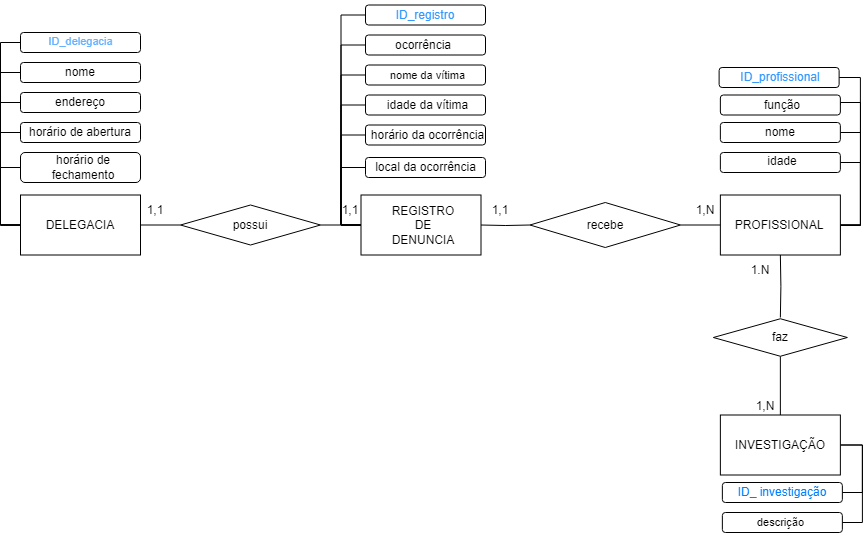

<h1 align="center"> TRABALHO INDIVIDUAL BANCO DE DADOS - RESIDÊNCIA TIC SERRATEC </h1>

  

  

</h1>

$$ Sobre o Projeto $$

Relação DELEGACIA - DENUNCIA.

# :hammer: Funcionalidades do projeto

- `Funcionalidade 1`: armazenamento de informações sobre diferentes ocorrências;
- `Funcionalidade 2`: otimização da investigação atravez dos filtros de pesquisa.

# 💡 Regras de Negócio
- `Regra 1`: uma investigação precisa contar necessariamente com a localidade da delagacia, o profissional responsável e um registro de denuncia;
- `Regra 2`: não é necessário informar a idade da vítima no registro de denuncia, em caso da vítima ser um estabecimento ou uma empresa;
- `Regra 3`: também não é necessário informar o nome da vítima no registro de denuncia, em caso de não existir uma;
- `Regra 4`: é preciso ao menos um profissional qualificado para cada ocorrência.

# :paperclip: Modelo Conceitual do Projeto

# :paperclip: Modelo Lógico do Projeto

# 👧: Autora - Rafaela Beber Coelho
